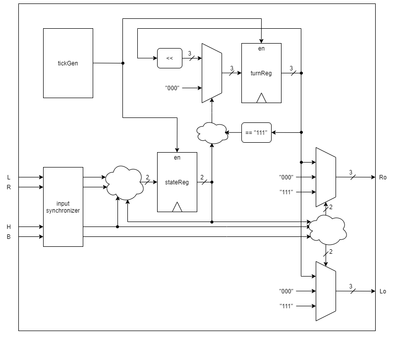

# Thunderbird FSMD 
 [source](https://www.pinterest.com/pin/50384089553303947/)

This projects implements the tail light system of the famous Ford Thunderbird as a FSMD in three different hardware description languages:
   - chisel
   - verilog
   - vhdl

The source files are located at `src/main` in the folder corresponding to each language.

## Implementation

Nearly the same design is implemented in all three languages. A Schematic of the FSMD is shown below.

